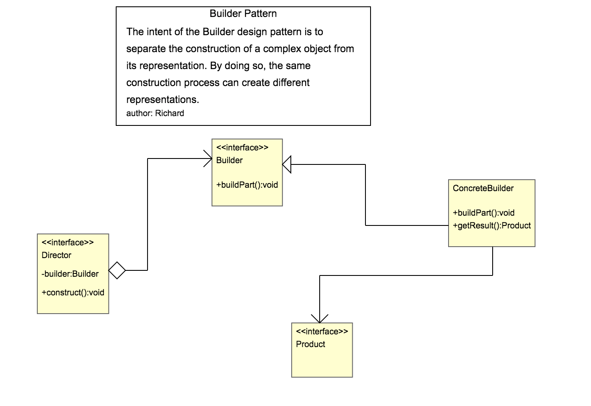

#carracci

A browser based tool with command line facilities for creating and editing uml diagrams

###Features

 * Create UML Class, Abstract Class and interface diagrams
 * edit through interactive graphics or via embedded command line interface

###Developers

 * Richard Hunter

[Carracci website](http://carracci.richardhunter.co.uk)

